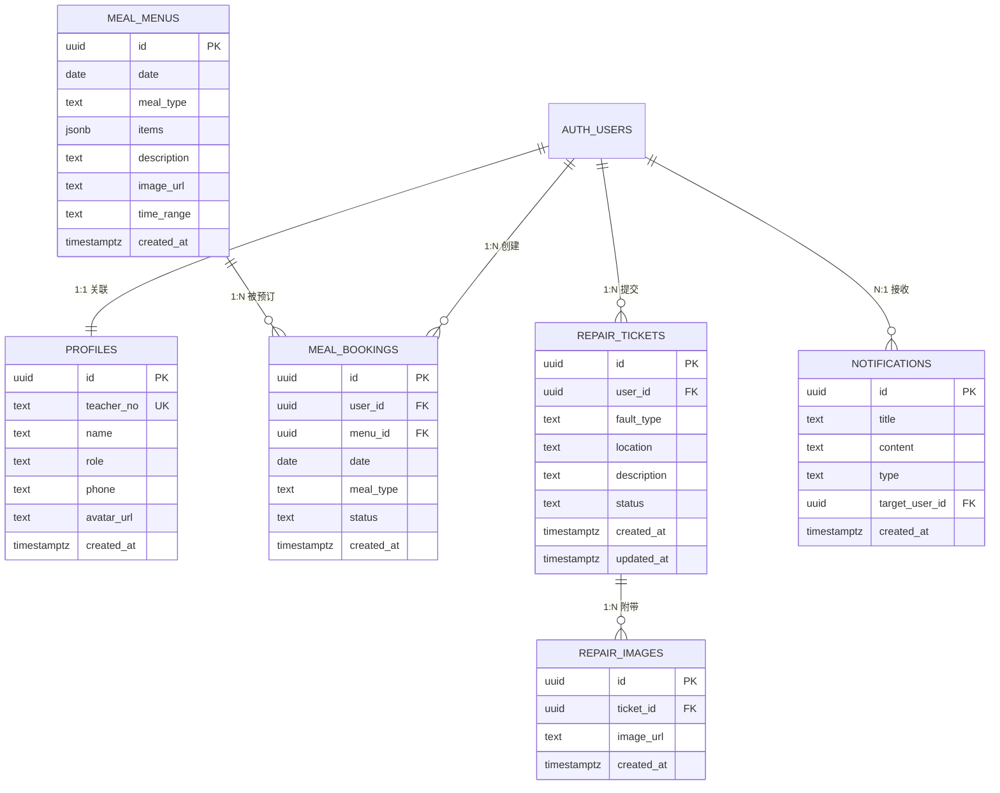

# 平潭二中移动校园 — 需求文档

> **项目名称**：PingTan Smart Campus（平潭二中移动校园）  

---

## 1. 项目概述

### 1.1 项目背景

平潭二中移动校园是一款面向学校教职工的智慧校园 Web 应用程序。项目旨在将学校日常管理中的**食堂报饭**、**设施报修**、**通知公告**等核心校务流程数字化，为教职工提供随时随地可用的移动端服务入口，提升校园管理效率和教职工生活便利性。

### 1.2 项目目标

| 目标维度 | 具体描述 |
|---------|---------|
| **便捷性** | 教职工可通过手机浏览器完成报饭、报修等日常操作，无需安装原生 App |
| **信息化** | 将纸质工单、口头通知等传统方式转为数字化管理，数据可追溯 |
| **实时性** | 菜单、工单状态、通知公告等信息实时同步，减少信息滞后 |
| **安全性** | 通过用户认证和角色权限控制，确保数据访问安全 |

### 1.3 目标用户

| 角色 | 描述 | 权限范围 |
|------|------|---------|
| **普通教职工（teacher）** | 学校教师及行政人员 | 查看/修改个人信息、食堂报饭、提交报修工单、查看通知公告 |
| **报饭管理员（admin）** | 食堂阿姨等 | 在教职工权限基础上，可查看全部报饭记录、管理菜单和通知 |
| **后勤管理员（admin）** | 信息化中心或后勤管理人员 | 在教职工权限基础上，可查看全部报修工单、管理通知 |
| **总管理员（admin）** | 开发者 | 在教职工权限基础上，可查看全部报饭记录、全部报修工单、管理菜单和通知，有所有权限 |

---

## 2. 功能需求

### 2.1 功能模块总览

```mermaid
graph TD
    A["平潭二中移动校园"] --> B["用户认证"]
    A --> C["首页 Dashboard"]
    A --> D["食堂报饭"]
    A --> E["设施报修"]
    A --> F["通知公告"]
    A --> G["个人中心"]
    
    B --> B1["邮箱+密码登录"]
    B --> B2["邮箱+密码注册"]
    B --> B3["路由保护/自动跳转"]
    
    C --> C1["动态问候语"]
    C --> C2["快捷应用入口"]
    C --> C3["通知面板入口"]
    
    D --> D1["日历选择日期"]
    D --> D2["每日菜单展示"]
    D --> D3["预订/取消餐次"]
    D --> D4["预订汇总统计"]
    
    E --> E1["故障类型选择"]
    E --> E2["故障信息填写"]
    E --> E3["现场照片上传"]
    E --> E4["工单列表查看"]
    
    F --> F1["全校通知"]
    F --> F2["定向通知"]
    F --> F3["通知分类标签"]
    
    G --> G1["个人信息展示"]
    G --> G2["最近订餐记录"]
    G --> G3["最近报修记录"]
    G --> G4["退出登录"]
```

### 2.2 用户认证模块

#### 2.2.1 登录

| 字段 | 说明 | 必填 | 验证规则 |
|------|------|------|---------|
| 邮箱 | 用户注册邮箱 | ✅ | 合法邮箱格式 |
| 密码 | 用户密码 | ✅ | 至少 6 位 |

**功能要求**：
- 支持邮箱 + 密码的方式登录
- 登录成功后跳转至首页 Dashboard（`/dashboard`）
- 登录失败时显示错误提示（Toast）
- 提供密码可见/隐藏切换按钮
- 登录过程中按钮显示加载状态，防止重复提交

#### 2.2.2 注册

| 字段 | 说明 | 必填 | 验证规则 |
|------|------|------|---------|
| 姓名 | 教职工真实姓名 | ✅ | 不可为空 |
| 邮箱 | 注册邮箱 | ✅ | 合法邮箱格式、不可重复 |
| 手机号 | 联系电话 | ❌ | 合法手机号格式 |
| 密码 | 账户密码 | ✅ | 至少 6 位 |

**功能要求**：
- 注册成功后自动登录并跳转至 Dashboard
- 注册时自动创建 `profiles` 记录（通过数据库触发器）
- 新注册用户默认角色为 `teacher`
- 管理员角色需在数据库后台手动修改

#### 2.2.3 路由保护

**功能要求**：
- 受保护路由包括：`/dashboard`、`/canteen`、`/repair`、`/profile`
- 未登录用户访问受保护路由时自动重定向至 `/login`
- 已登录用户访问 `/login` 时自动重定向至 `/dashboard`
- 根路径 `/` 自动重定向至 `/login`
- Session 自动刷新（通过中间件实现）

---

### 2.3 首页 Dashboard 模块

**功能要求**：

1. **动态问候**
   - 根据当前时间显示中文问候语：「早上好」「中午好」「下午好」「晚上好」「夜深了」
   - 显示当前用户姓名
   - 显示当前日期（格式：YYYY年M月D日 · 星期X）
   - 根据时间段显示不同图标（太阳/月亮）

2. **用户头像**
   - 展示用户头像（若已上传）
   - 未上传头像时显示默认人物图标

3. **快捷应用入口**（2×2 网格布局）
   - **食堂订餐**：链接至 `/canteen`，提示「今日菜单已更新」
   - **设施报修**：链接至 `/repair`，提示「快速提交工单」
   - **通知公告**：点击打开通知面板，显示未读红点

4. **通知面板**
   - 从底部滑出的面板（Bottom Sheet 形式）
   - 展示通知列表，按创建时间倒序排列
   - 每条通知显示：类型标签（通知/注意/紧急）、标题、内容摘要、发布日期
   - 支持关闭面板

5. **底部导航栏**
   - 固定在底部，包含两个 Tab：「首页」和「我的」
   - 当前活跃 Tab 高亮显示（Material Symbols filled 样式）
   - 毛玻璃背景效果

---

### 2.4 食堂报饭模块

**功能要求**：

1. **日期选择**
   - 以周为单位展示日期选择器（周日至周六）
   - 高亮显示当前选中日期
   - 标记「今天」的日期
   - 支持前后切换周
   - 显示当前年月

2. **菜单展示**
   - 按餐次（早餐/午餐/晚餐）展示当日菜单卡片
   - 每个菜单卡片包含：
     - 菜品图片（全宽顶部展示）
     - 餐次名称与图标（早餐=日出、午餐=太阳、晚餐=月亮）
     - 供餐时间范围
     - 菜品列表（标签形式展示）
     - 菜单描述
   - 无菜单时显示空状态提示

3. **预订操作**
   - 未预订状态：显示「立即预订」按钮
   - 已预订状态：
     - 卡片左侧显示主色条
     - 图片区域覆盖品牌色蒙版
     - 右上角显示「已预订」徽章
     - 底部显示「已确认用餐」状态及「取消预订」按钮
   - 操作过程中显示加载状态
   - 不可重复预订同一餐次（unique 约束提示）

4. **汇总栏**
   - 页面底部固定显示「今日汇总：已预订 X 餐」

---

### 2.5 设施报修模块

**功能要求**：

1. **故障类型选择**
   - 提供 4 种故障类型选择：
     - 水电门窗（图标：home_repair_service）
     - 多媒体（图标：router）
     - 空调（图标：ac_unit）
     - 其他（图标：more_horiz）
   - 横向滚动选择，选中态高亮

2. **故障地点输入**
   - 文本输入框，支持手动输入
   - 提供快捷地点标签：302教室、办公楼2F、实验楼3F、图书馆
   - 点击快捷标签自动填入

3. **故障描述**
   - 多行文本域，4 行高度
   - 引导文案：「请详细描述故障情况，以便维修人员快速处理...」

4. **现场照片上传**
   - 最多上传 3 张图片
   - 上传至 Supabase Storage `repair-images` bucket
   - 支持预览已上传图片
   - 支持删除已上传图片
   - 上传过程显示加载动画

5. **提交报修**
   - 表单验证：故障类型、地点、描述为必填
   - 提交成功后：
     - 显示成功 Toast
     - 清空表单
     - 刷新工单列表
   - 底部固定提交按钮

6. **我的工单**
   - 可折叠/展开的工单列表
   - 显示最近 10 条工单
   - 每条工单显示：故障类型、地点、描述摘要、状态标签、创建时间
   - 工单状态颜色区分：
     - 待处理：琥珀色
     - 处理中：蓝色
     - 已完成：绿色

---

### 2.6 通知公告模块

**功能要求**：

1. **通知类型**
   - `info`（通知）：蓝色标签
   - `warning`（注意）：琥珀色标签
   - `urgent`（紧急）：红色标签

2. **通知读取**
   - 显示最近 20 条通知
   - 支持全校通知（`target_user_id` 为 null）和定向通知（`target_user_id` 指定用户）
   - 按创建时间倒序排列
   - 每条通知展示：类型标签、标题、内容、发布日期

3. **空状态**
   - 无通知时显示空状态图标和提示文字

---

### 2.7 个人中心模块

**功能要求**：

1. **个人信息展示**
   - 头像（大尺寸展示）
   - 姓名
   - 教职工号
   - 管理员角色标识（如有）
   - 邮箱
   - 手机号

2. **最近订餐记录**
   - 显示最近 5 条订餐记录
   - 每条显示：餐次名称、日期、状态（已预订/已取消）
   - 提供「查看全部」链接跳转至食堂报饭页

3. **最近报修记录**
   - 显示最近 5 条报修工单
   - 每条显示：故障类型、地点、状态标签
   - 提供「查看全部」链接跳转至设施报修页

4. **退出登录**
   - 清除当前 Session
   - 跳转至登录页

---

## 3. 非功能需求

### 3.1 性能需求

| 指标 | 要求 |
|------|------|
| 页面首屏加载 | ≤ 3 秒（3G 网络环境） |
| 交互响应 | 按钮点击反馈 ≤ 200ms |
| 数据加载 | API 请求超时 ≤ 10 秒 |

### 3.2 兼容性需求

| 维度 | 要求 |
|------|------|
| 设备类型 | 以移动端为主（max-width: 448px 视觉优化），桌面端可用 |
| 浏览器 | Chrome 90+、Safari 14+、Firefox 88+、Edge 90+ |
| 操作系统 | iOS 14+、Android 10+、Windows 10+、macOS 11+ |

### 3.3 安全需求

| 维度 | 要求 |
|------|------|
| 认证方式 | Supabase Auth（JWT token，HttpOnly Cookie 存储） |
| 数据隔离 | Row Level Security（RLS），用户仅可访问自身数据 |
| 管理权限 | admin 角色可查看全部数据 |
| 文件上传 | 仅认证用户可上传，文件按用户 ID 隔离目录 |
| 环境变量 | 敏感信息（API Key）存储于 `.env.local`，不提交至版本控制 |

### 3.4 可用性需求

| 维度 | 要求 |
|------|------|
| 语言 | 全中文界面 |
| 操作反馈 | 所有操作提供 Toast 提示（成功/失败） |
| 加载状态 | 异步操作显示 loading 动画 |
| 空状态 | 无数据时显示友好的空状态提示 |
| 错误处理 | 网络错误、业务错误均有明确的中文提示 |

### 3.5 设计规范

| 维度 | 规格 |
|------|------|
| 主色 | `#2d7670`（深青绿） |
| 主色深色 | `#1f5651` |
| 主色浅色 | `#eaf2f1` |
| 背景色 | `#f9fafb` |
| 文字主色 | `#111817` |
| 文字辅色 | `#5e8784` |
| 主字体 | Manrope + Noto Sans SC |
| 图标 | Material Symbols Outlined（Google Fonts） |
| 圆角 | 大量使用 `rounded-xl`（0.75rem）至 `rounded-3xl`（1.5rem） |
| 阴影 | 柔和阴影 `shadow-soft` + 卡片阴影 `shadow-card` |
| 动效 | Toast 入出场动画、卡片 hover 缩放、按钮 active 缩放 |

---

## 4. 数据需求

### 4.1 数据实体关系

### 4.2 业务约束

| 约束 | 说明 |
|------|------|
| 用户角色 | 仅支持 `teacher` 和 `admin` 两种角色 |
| 餐次类型 | 仅支持 `breakfast`、`lunch`、`dinner` |
| 每日菜单唯一性 | 同一天同一餐次仅可有一条菜单记录 |
| 预订唯一性 | 同一用户同一天同一餐次仅可预订一次 |
| 故障类型 | 仅支持「水电门窗」「多媒体」「空调」「其他」 |
| 工单状态 | 仅支持「待处理」「处理中」「已完成」三种状态流转 |
| 通知类型 | 仅支持 `info`、`warning`、`urgent` |
| 图片上传 | 每个报修工单最多 3 张图片 |

---

## 5. 部署需求

| 维度 | 要求 |
|------|------|
| 前端部署 | Vercel 或自托管 |
| 后端服务 | Supabase Cloud（Auth + PostgreSQL + Storage） |
| 域名 | 待定 |
| HTTPS | 必须 |
| 环境变量 | `NEXT_PUBLIC_SUPABASE_URL`、`NEXT_PUBLIC_SUPABASE_ANON_KEY` |

---

## 6. 功能实现状态

| 模块 | 功能 | 状态 |
|------|------|------|
| 用户认证 | 邮箱 + 密码登录/注册 | ✅ 已完成 |
| 路由保护 | 未登录自动跳转 login | ✅ 已完成 |
| 首页 | 动态问候、快捷入口、通知面板 | ✅ 已完成 |
| 食堂报饭 | 日期选择、菜单展示、预订/取消 | ✅ 已完成 |
| 设施报修 | 类型选择、表单填写、图片上传、工单列表 | ✅ 已完成 |
| 通知公告 | 从 notifications 表读取展示 | ✅ 已完成 |
| 管理员 | admin 角色可查看全部数据 | ✅ 已完成 |
| 退出登录 | 清除 session 跳转 login | ✅ 已完成 |

---

## 7. 待规划功能

> 以下为尚未实现但可扩展的功能方向：

| 功能 | 优先级 | 说明 |
|------|--------|------|
| 忘记密码 | 高 | 原始设计稿中包含该功能入口，当前未实现 |
| 记住我 | 中 | 原始设计稿中包含该功能，当前未实现 |
| 头像上传 | 中 | 数据库已预留 `avatar_url` 字段，UI 未实现编辑功能 |
| 个人信息编辑 | 中 | 修改姓名、手机号等信息 |
| 暗色模式 | 低 | 原始设计稿中包含暗色模式配色定义，当前未实现切换 |
| 管理员后台 | 高 | 菜单管理（CRUD）、工单处理、通知发布 |
| 报修工单评价 | 低 | 工单完成后的服务评价 |
| 消息推送 | 中 | 新通知/工单状态变更的实时推送 |
| 数据统计 | 中 | 报饭数据、报修数据的统计图表 |
